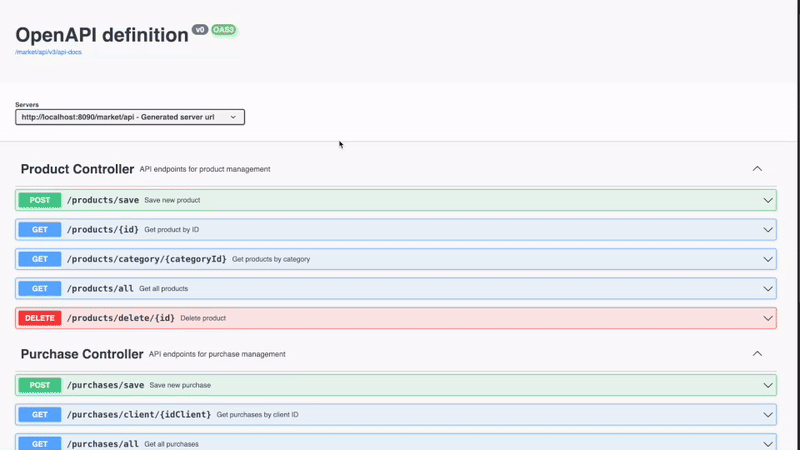

<p align="center">
  <a href="https://spring.io/projects/spring-boot" target="_blank">
    
  </a>
</p>

<h1 align="center">
  Spring Boot Market REST API
</h1>

<p align="center">
  
</p>

<p align="center">
  Modern, Secure, and Scalable REST API built with Spring Boot
</p>

<p align="center">
  <a href="https://spring.io/projects/spring-boot" target="_blank">
    Spring Boot 3
  </a>
  ·
  <a href="https://www.postgresql.org/" target="_blank">
    PostgreSQL
  </a>
  ·
  <a href="https://springdoc.org/" target="_blank">
    OpenAPI/Swagger
  </a>
</p>

* [Quick Guide](#-quick-guide)
* [Features](#-features)
* [Tech Stack](#-tech-stack)
* [Project Structure](#-project-structure)

### 🤖 Quick Guide

1. **Start Development**
   
   Clone the repository
   ```sh
   git clone <repository-url>
   cd market-api
   ```

   Configure PostgreSQL
   ```properties
   # Update application-pdn.properties with your database credentials
   spring.datasource.url=jdbc:postgresql://localhost:5432/market_db
   spring.datasource.username=your_username
   spring.datasource.password=your_password
   ```

   Run the application
   ```sh
   ./gradlew bootRun
   ```
   Navigate to `http://localhost:8080/swagger-ui/index.html` for API documentation.

2. **Build for Production**
   ```sh
   ./gradlew build
   ```
   The build artifacts will be stored in the `build/libs/` directory.

### 🚀 Features

1. **Product Management**
   - CRUD operations for products
   - Category-based filtering
   - Comprehensive product information
   - Efficient data mapping with MapStruct

2. **Purchase System**
   - Create and track purchases
   - Client purchase history
   - Purchase items management
   - Transaction support

3. **API Features**
   - RESTful endpoints
   - Swagger/OpenAPI documentation
   - Error handling
   - Response status codes
   - Logging system

### 💻 Tech Stack

- **Framework**: Spring Boot 3.4.1
- **Build Tool**: Gradle 8
- **Database**: 
  - PostgreSQL
  - Spring Data JPA
- **Documentation**: SpringDoc OpenAPI
- **Mapping**: MapStruct
- **Java Version**: 21
- **Testing**: JUnit 5

### 📚 Key Components

- `ProductController`: Product management endpoints
- `PurchaseController`: Purchase processing endpoints
- `Service Layer`: Business logic implementation
- `Repository Layer`: Data access interfaces
- `Domain Models`: Entity definitions
- `DTOs`: Data transfer objects
- `Mappers`: MapStruct object mapping

### 🛠️ Development Commands

1. **Run Tests**:
   ```sh
   ./gradlew test
   ```

2. **Clean Build**:
   ```sh
   ./gradlew clean build
   ```

3. **Run Application**:
   ```sh
   ./gradlew bootRun
   ```

### 📚 API Documentation

- Access Swagger UI: `http://localhost:8080/swagger-ui/index.html`
- OpenAPI definition: `http://localhost:8080/v3/api-docs`

### 🔐 Environment Setup

Configure your `application-pdn.properties`:

```properties
# Database Configuration
spring.datasource.url=jdbc:postgresql://localhost:5432/market_db
spring.datasource.username=your_username
spring.datasource.password=your_password

# JPA/Hibernate
spring.jpa.database-platform=org.hibernate.dialect.PostgreSQLDialect
spring.jpa.hibernate.ddl-auto=update

# Server Configuration
server.port=8080
```

### 🤝 Contributing

1. Fork the Project
2. Create your Feature Branch (`git checkout -b feature/AmazingFeature`)
3. Commit your Changes (`git commit -m 'Add some AmazingFeature'`)
4. Push to the Branch (`git push origin feature/AmazingFeature`)
5. Open a Pull Request

### 📝 License

This project is licensed under the MIT License - see the [LICENSE.md](LICENSE.md) file for details

### 🙏 Acknowledgments

- Spring Boot team for the amazing framework
- PostgreSQL for reliable data storage
- OpenAPI for API documentation

Happy coding! 🚀